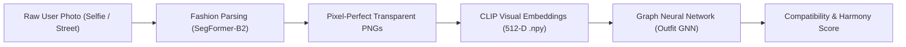
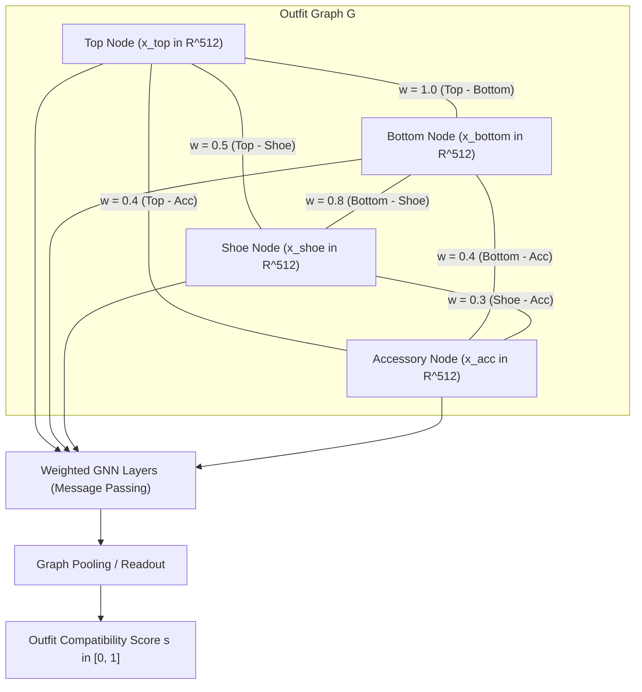

# Real-Image Garment Understanding & GNN Outfit Compatibility Handoff Guide

> **Target Audience**: Incoming Machine Learning Engineers, GNN/Recommendation Specialists, and Data Engineers.  
> **Repository**: `AI-based-personal-stylist`  
> **Pipeline Components**: `real_image_pipeline/` -> `outputs/` -> `TrynTest/gnn_outfit_compatibility_v2.py`

---

## 1. Executive Summary & Objective

In real-world fashion recommendation systems, user input images are messy: selfies, elevator mirror shots, wild angles, layered outfits, and complex lighting.

The goal of this pipeline is to act as the **Perception Engine**:



1. **Perception**: Takes any wild user photo and extracts every individual garment with **exact pixel-level transparency** (no room background, no bare skin).
2. **Representation**: Computes a **512-dimensional L2-normalized visual embedding** (`.npy`) using OpenAI CLIP (`ViT-B/32`).
3. **Graph Construction**: Passes these embeddings as **Node Features** (`x_i in R^512`) into the **Outfit Graph Neural Network (GNN)** to predict outfit compatibility, style harmony, and fill-in-the-blank (FITB) recommendations.

---

## 2. The Evolution: Pehle (Before) vs Abhi (Now)

To understand why the architecture is designed this way, here is the breakdown of why earlier approaches broke and how the current solution solves them:

| Challenge | Pehle (DeepFashion2 / YOLOS Studio Models) | Pehle (Generic Saliency / GrabCut) | Abhi (Current Production Pipeline) |
|---|---|---|---|
| **Real User Photos & Selfies** | Trained exclusively on upright catalog fashion models with white backgrounds. Hallucinated pants on chests in mirror selfies. | N/A | **Human Fashion Parsing (SegFormer)** trained on real diverse poses, selfies, and streetwear. |
| **Dark Garments (e.g. Black Duck T-shirt in `010931`)** | Box was bounding the torso, but had no pixel mask. | Saliency (`U2Net`) assumed face/hair was the only foreground subject and **erased 85% of dark fabric**. | **SegFormer Clothing Semantic Masking** keeps 100% of fabric, print logos, necklaces, and textures intact. |
| **Garment Isolation Quality** | Outputted raw square boxes with entire room/walls attached. | `GrabCut` produced jagged, chopped-up edges (chopping off graphics and sleeve hems). | **Pixel-accurate anatomical contours** with zero room noise and clean alpha transparency. |
| **Category Overlap & Label Hallucination** | Competing text prompts caused duplicate boxes on the same top (`sweater (0.49)` + `shirt_blouse (0.22)` + `t_shirt (0.24)`). | N/A | **Two-Stage Disambiguation**: SegFormer assigns anatomical region (`Upper-clothes`), then **CLIP zero-shot classification** precisely names the subcategory on the isolated crop (`t_shirt`). |
| **Vector Embeddings for GNN** | Embeddings computed on noisy raw boxes had background room features polluting the vector space. | Faded saliency cutouts produced degraded embeddings. | **Pure Garment Embeddings**: CLIP encodes pure fabric on neutral canvas -> **512-D unit vectors (L2 norm = 1.0)**. |

---

## 3. Pipeline Architecture (Step-by-Step)

The production pipeline is located in `real_image_pipeline/` and consists of three core stages:

```
real_image_pipeline/
├── fashion_segmenter.py       # Stage 1 & 2: SegFormer Clothes Parsing + Transparent Crop Extraction
├── clip_extract_embeddings.py # Stage 3: CLIP ViT-B/32 512-D L2-Normalized Visual Feature Extractor
├── category_mapping.py        # Fashion Taxonomy & Category Group Normalization
├── run_pipeline.py            # End-to-End Orchestrator (Single & Batch CLI)
└── test_pipeline.py           # Automated Unit Test Suite
```

### Stage 1: Human Fashion Parsing (`SegFormer-B2-Clothes`)
- **Model**: `mattmdjaga/segformer_b2_clothes` (Transformer Semantic Segmentation)
- **Input**: Raw RGB user photo (H x W x 3)
- **Output**: Full-resolution 2D semantic mask classifying every pixel into:
  - `0: Background` (walls, elevators, furniture)
  - `1: Hat`
  - `3: Sunglasses`
  - `4: Upper-clothes` (t-shirts, shirts, sweaters, jackets, hoodies, tops)
  - `5: Skirt`
  - `6: Pants` (jeans, sweatpants, shorts)
  - `7: Dress`
  - `8: Belt`
  - `9/10: Shoes`
  - `16: Bag`
  - `Face / Hair / Arms / Legs`: Automatically separated as non-garment human anatomy!

### Stage 2: Precision Transparent RGBA Extraction
- For each detected clothing category, a binary mask is extracted.
- The alpha channel is set to `255` for garment pixels and `0` for background/skin.
- The isolated garment is tightly cropped and saved as:
  `outputs/<image_id>/<category>_<index>.png`

### Stage 3: Fine-Grained Categorization & CLIP Embedding
- **Model**: OpenAI CLIP (`ViT-B/32`)
- **Crop Classification**: Uses zero-shot prompt ranking on the isolated crop to identify specific garment type (e.g. `t_shirt` vs `sweater` vs `jacket`, `shorts` vs `pants`).
- **Embedding Generation**: Encodes the isolated crop composited on a neutral canvas to produce:
  `e = CLIP_vision(garment_crop) in R^512`
  `x = e / ||e||_2, ||x||_2 = 1.0`
- Saved directly as `outputs/<image_id>/<category>_<index>.npy`.

---

## 4. Output Contract & Data Schema

Every processed photo creates a dedicated folder in `outputs/<image_id>/`:

```
outputs/010931/
├── t_shirt_0.png        # Clean transparent garment crop (RGBA)
├── t_shirt_0.npy        # 512-D L2-normalized float32 CLIP vector
├── 010931_vis.jpg       # Color-coded visual bounding box overlay
└── metadata.json        # Comprehensive metadata & bounding box coordinates
```

### `metadata.json` Schema:
```json
[
  {
    "file": "t_shirt_0.png",
    "category": "t_shirt",
    "specific_category": "t_shirt",
    "broad_category": "top",
    "raw_category": "Upper-clothes",
    "confidence": 0.8197,
    "pixel_count": 137004,
    "bbox": [0, 291, 468, 702],
    "crop_path": "outputs/010931/t_shirt_0.png",
    "embedding_path": "outputs/010931/t_shirt_0.npy",
    "embedding_dim": 512
  }
]
```

---

## 5. How This Feeds Directly into the GNN (`TrynTest/gnn_outfit_compatibility_v2.py`)

The downstream **Outfit Compatibility GNN** models an outfit as a **heterogeneous garment graph** `G = (V, E)`:



### 1. Node Features (X in R^(N x 512))
Each node `i` corresponds to an extracted garment (`.png`) and its initial feature representation is its **CLIP embedding**:
```python
x_i = np.load(f"outputs/{outfit_id}/{category}_{index}.npy")
```

### 2. Edge Index & Category Weighting
Edges represent compatibility relationships between clothing items. The GNN in `TrynTest/gnn_outfit_compatibility_v2.py` uses fashion-domain edge importance:
- **`Top <-> Bottom`**: Weight `1.0` (core outfit pairing)
- **`Outerwear <-> Bottom`**: Weight `0.8`
- **`Bottom <-> Footwear`**: Weight `0.8`
- **`Dress <-> Footwear`**: Weight `0.9`
- **`Top <-> Accessory`**: Weight `0.4`

### 3. PyTorch GNN Graph Loader Snippet
Here is the plug-and-play loader to construct a graph directly from an `outputs/` folder:

```python
import os
import json
import numpy as np
import torch

def load_outfit_graph_for_gnn(outfit_dir: str):
    """
    Loads an extracted outfit folder into PyTorch tensors for GNN inference.
    """
    meta_path = os.path.join(outfit_dir, "metadata.json")
    with open(meta_path, "r") as f:
        garments = json.load(f)

    if not garments:
        return None

    node_features = []
    categories = []

    for g in garments:
        # Load 512-D L2-normalized CLIP embedding
        emb_file = os.path.splitext(g["file"])[0] + ".npy"
        emb_path = os.path.join(outfit_dir, emb_file)
        feat = np.load(emb_path)
        node_features.append(feat)
        categories.append(g.get("broad_category", "accessory"))

    # Convert to PyTorch Tensor (N, 512)
    x = torch.tensor(np.array(node_features), dtype=torch.float32)

    # Build fully-connected outfit graph with category weights
    src, dst, weights = [], [], []
    N = len(garments)
    for i in range(N):
        for j in range(N):
            if i != j:
                src.append(i)
                dst.append(j)
                # Compute weight based on category pair
                w = 1.0 if {categories[i], categories[j]} == {"top", "bottom"} else 0.5
                weights.append(w)

    edge_index = torch.tensor([src, dst], dtype=torch.long)
    edge_weights = torch.tensor(weights, dtype=torch.float32)

    return {
        "x": x,                         # Node feature matrix: (N, 512)
        "edge_index": edge_index,       # Graph connectivity: (2, E)
        "edge_weights": edge_weights,   # Domain-weighted edges: (E,)
        "categories": categories,       # Garment categories
        "num_nodes": N
    }
```

---

## 6. How to Run the Pipeline

### Process a Single Image:
```bash
python real_image_pipeline/run_pipeline.py --image data/input_images/010931.jpg
```

### Process an Entire Directory of Real Photos:
```bash
python real_image_pipeline/run_pipeline.py --input_dir data/input_images/
```

### Run Automated Unit Tests:
```bash
python real_image_pipeline/test_pipeline.py
```

---

## 7. Summary for Downstream Engineers

1. **Do not re-segment or re-crop**: The PNG cutouts in `outputs/` are already pixel-isolated via SegFormer transformer parsing.
2. **Use `.npy` files directly**: Every `.npy` file contains a unit-normalized 512-D float32 vector ready for GNN linear projection layers.
3. **Check `metadata.json`**: It contains ground-truth bounding box dimensions, pixel coverage, and broad category tags (`top`, `bottom`, `dress`, `accessory`).
4. **All unit tests pass**: The suite in `real_image_pipeline/test_pipeline.py` verifies embedding dimensions, L2 unit norms, and category mappings.
