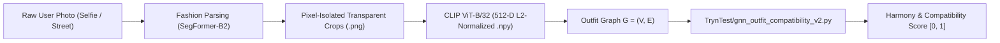

# 👗 AI-Based Personal Stylist

An end-to-end intelligent fashion pipeline that transforms wild, real-world user photos (selfies, full-body, street photos) into pixel-accurate garment cutouts, extracts 512-D normalized CLIP vector representations, and scores outfit harmony and compatibility using a Graph Neural Network (GNN).

---

## 🚀 Architecture Overview



---

## 📁 Repository Structure (`clean-pipeline`)

```
AI-based-personal-stylist/
├── real_image_pipeline/           # 🌟 Perception & Feature Extraction Engine
│   ├── fashion_segmenter.py       # SOTA Human Fashion Parsing (SegFormer-B2) + RGBA cutouts
│   ├── clip_extract_embeddings.py # 512-D L2-Normalized CLIP Visual Feature Extractor
│   ├── category_mapping.py        # Fashion Taxonomy & Category Group Normalization
│   ├── run_pipeline.py            # CLI Orchestrator (Single Image & Batch Processing)
│   ├── test_pipeline.py           # Automated Test Suite
│   ├── requirements.txt           # Python Dependencies
│   └── PIPELINE_HANDOFF_GUIDE.md  # Detailed Engineering & Perception Documentation
│
├── TrynTest/                      # 🧠 Graph Neural Network (GNN) Outfit Scoring
│   ├── gnn_outfit_compatibility_v2.py # Weighted Outfit GNN (Compatibility & FITB)
│   └── PIPELINE_HANDOFF_GUIDE.md  # Direct GNN Handoff & Graph Construction Spec
│
├── data/
│   └── input_images/              # Real-world benchmark user photos (010930 - 010950)
│
├── outputs/                       # Processed garment cutouts, embeddings & metadata
│   ├── 010930/ ... 010950/
│   │   ├── <category>_<idx>.png   # Alpha transparent garment crop
│   │   ├── <category>_<idx>.npy   # 512-D normalized float32 CLIP vector
│   │   └── metadata.json          # Bounding boxes, categories & confidence
│   └── *_vis.jpg                  # Annotated visual inspection overlays
│
└── requirements.txt               # Top-level dependencies
```

---

## ⚡ Quick Start

### 1. Installation
```bash
git clone https://github.com/bugsNburgers/AI-based-personal-stylist.git
cd AI-based-personal-stylist
git checkout clean-pipeline

pip install -r requirements.txt
```

### 2. Process a Single Real Photo
```bash
python real_image_pipeline/run_pipeline.py --image data/input_images/010931.jpg
```
Output generated in `outputs/010931/`:
- `t_shirt_0.png` (transparent background)
- `t_shirt_0.npy` (512-D normalized vector)
- `010931_vis.jpg` (visual overlay)
- `metadata.json` (coordinates & tags)

### 3. Batch Process Entire Directory
```bash
python real_image_pipeline/run_pipeline.py --input_dir data/input_images/
```

### 4. Run Automated Test Suite
```bash
python real_image_pipeline/test_pipeline.py
```

---

## 📖 Documentation & GNN Handoff
For the complete technical deep dive and PyTorch Geometric graph loader instructions, see:
- **[`real_image_pipeline/PIPELINE_HANDOFF_GUIDE.md`](file:///c:/Users/Suprateek%20Yawagal/OneDrive/Documents/AI-based-personal-stylist/real_image_pipeline/PIPELINE_HANDOFF_GUIDE.md)**
- **[`TrynTest/PIPELINE_HANDOFF_GUIDE.md`](file:///c:/Users/Suprateek%20Yawagal/OneDrive/Documents/AI-based-personal-stylist/TrynTest/PIPELINE_HANDOFF_GUIDE.md)**
